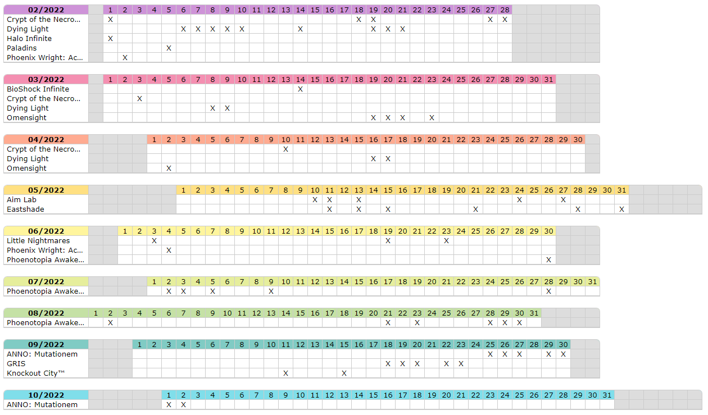

# Steam-to-calendar

View its Steam history on a calendar.

This program :

- Parse the Steam website and save the retrieved data to a file
- Generate an calendar image based on a data file

The data retrieved is :

- [ ] The account creation date
- [X] The achievements dates
- [ ] The purchases date

## Run Locally

Clone the project and go to the directory

```bash
  git clone https://github.com/fsabre/steam-to-calendar.git
  cd steam-to-calendar
```

Place the webdriver corresponding to your web
browser ([Selenium documentation](https://www.selenium.dev/documentation/webdriver/getting_started/install_drivers/))
in the directory (works with Chromium-based browsers for now)

Update the paths in `src/config.py`

```python3
CHROME_PATH: Final = r"C:\Program Files\Vivaldi\Application\Vivaldi.exe"
CHROME_DRIVER_PATH: Final = "chromedriver.exe"
```

Install dependencies

```bash
  python3 -m venv venv
  source venv/bin/activate
  pip install -r requirements.txt
```

Run the program

```bash
  python stc.py fetch YOUR_STEAM_PROFILE_URL
  python stc.py draw
```

## Screenshots

### HTML export



### Text export

```text
----- 02/2022 -----     1   2   3   4   5   6   7   8   9   10  11  12  13  14  15  16  17  18  19  20  21  22  23  24  25  26  27  28                       
Crypt of the Nec        X   .   .   .   .   .   .   .   .   .   .   .   .   .   .   .   .   X   X   .   .   .   .   .   .   .   X   X                        
Dying Light             .   .   .   .   .   X   X   X   X   X   .   .   .   X   .   .   .   .   X   X   X   .   .   .   .   .   .   .                        
Halo Infinite           X   .   .   .   .   .   .   .   .   .   .   .   .   .   .   .   .   .   .   .   .   .   .   .   .   .   .   .                        
Paladins                .   .   .   .   X   .   .   .   .   .   .   .   .   .   .   .   .   .   .   .   .   .   .   .   .   .   .   .                        
Phoenix Wright:         .   X   .   .   .   .   .   .   .   .   .   .   .   .   .   .   .   .   .   .   .   .   .   .   .   .   .   .                        
----- 03/2022 -----     1   2   3   4   5   6   7   8   9   10  11  12  13  14  15  16  17  18  19  20  21  22  23  24  25  26  27  28  29  30  31           
BioShock Infinit        .   .   .   .   .   .   .   .   .   .   .   .   .   X   .   .   .   .   .   .   .   .   .   .   .   .   .   .   .   .   .            
Crypt of the Nec        .   .   X   .   .   .   .   .   .   .   .   .   .   .   .   .   .   .   .   .   .   .   .   .   .   .   .   .   .   .   .            
Dying Light             .   .   .   .   .   .   .   X   X   .   .   .   .   .   .   .   .   .   .   .   .   .   .   .   .   .   .   .   .   .   .            
Omensight               .   .   .   .   .   .   .   .   .   .   .   .   .   .   .   .   .   .   X   X   X   .   X   .   .   .   .   .   .   .   .            
----- 04/2022 -----                 1   2   3   4   5   6   7   8   9   10  11  12  13  14  15  16  17  18  19  20  21  22  23  24  25  26  27  28  29  30   
Crypt of the Nec                    .   .   .   .   .   .   .   .   .   X   .   .   .   .   .   .   .   .   .   .   .   .   .   .   .   .   .   .   .   .    
Dying Light                         .   .   .   .   .   .   .   .   .   .   .   .   .   .   .   X   X   .   .   .   .   .   .   .   .   .   .   .   .   .    
Omensight                           .   X   .   .   .   .   .   .   .   .   .   .   .   .   .   .   .   .   .   .   .   .   .   .   .   .   .   .   .   .    
----- 05/2022 -----                         1   2   3   4   5   6   7   8   9   10  11  12  13  14  15  16  17  18  19  20  21  22  23  24  25  26  27  28  29  30  31                   
Aim Lab                                     .   .   .   .   .   .   .   .   .   X   X   .   X   .   .   .   .   .   .   .   .   .   .   X   .   .   X   .   .   .   .                    
Eastshade                                   .   .   .   .   .   .   .   .   .   .   X   .   X   .   X   .   .   .   .   .   X   .   .   .   .   .   .   X   .   .   X                    
----- 06/2022 -----         1   2   3   4   5   6   7   8   9   10  11  12  13  14  15  16  17  18  19  20  21  22  23  24  25  26  27  28  29  30           
Little Nightmare            .   .   X   .   .   .   .   .   .   .   .   .   .   .   .   .   .   .   X   .   .   .   X   .   .   .   .   .   .   .            
Phoenix Wright:             .   .   .   X   .   .   .   .   .   .   .   .   .   .   .   .   .   .   .   .   .   .   .   .   .   .   .   .   .   .            
Phoenotopia Awak            .   .   .   .   .   .   .   .   .   .   .   .   .   .   .   .   .   .   .   .   .   .   .   .   .   .   .   .   .   X            
----- 07/2022 -----                 1   2   3   4   5   6   7   8   9   10  11  12  13  14  15  16  17  18  19  20  21  22  23  24  25  26  27  28  29  30  31
Phoenotopia Awak                    .   X   X   .   X   .   .   .   X   .   .   .   .   .   .   .   .   .   .   .   .   .   .   .   .   .   .   X   .   .   .
----- 08/2022 ----- 1   2   3   4   5   6   7   8   9   10  11  12  13  14  15  16  17  18  19  20  21  22  23  24  25  26  27  28  29  30  31               
Phoenotopia Awak    .   X   .   .   .   .   .   .   .   .   .   .   .   .   .   .   .   .   .   .   X   .   X   .   .   .   .   X   X   X   .                
----- 09/2022 -----             1   2   3   4   5   6   7   8   9   10  11  12  13  14  15  16  17  18  19  20  21  22  23  24  25  26  27  28  29  30       
ANNO: Mutationem                .   .   .   .   .   .   .   .   .   .   .   .   .   .   .   .   .   .   .   .   .   .   .   .   X   X   X   .   X   X        
GRIS                            .   .   .   .   .   .   .   .   .   .   .   .   .   .   .   .   .   X   X   X   .   X   X   .   .   .   .   .   .   .        
Knockout City™                  .   .   .   .   .   .   .   .   .   .   X   .   .   .   X   .   .   .   .   .   .   .   .   .   .   .   .   .   .   .        
----- 10/2022 -----                     1   2   3   4   5   6   7   8   9   10  11  12  13  14  15  16  17  18  19  20  21  22  23  24  25  26  27  28  29  30  31                       
ANNO: Mutationem                        X   X   .   .   .   .   .   .   .   .   .   .   .   .   .   .   .   .   .   .   .   .   .   .   .   .   .   .   .   .   .          
```
